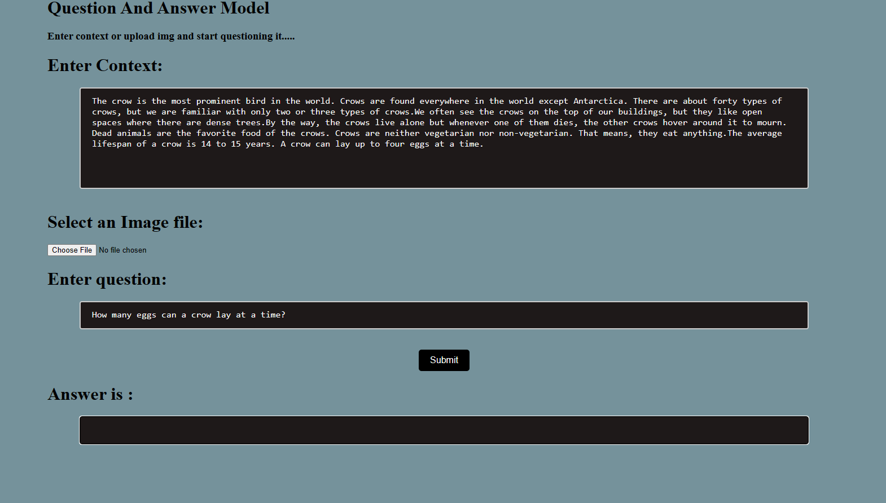
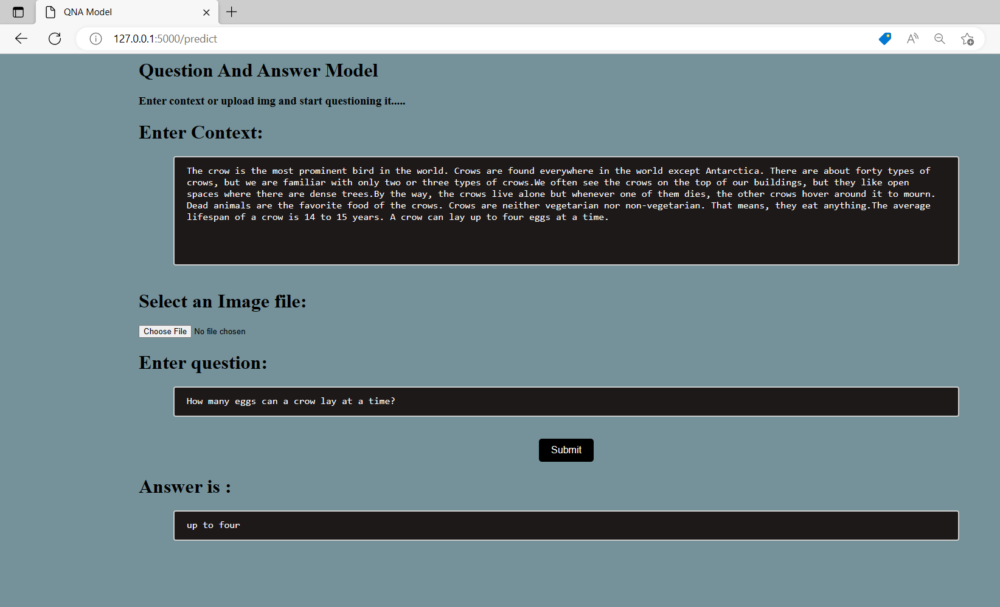

# Question_Answer_Model
 A simple Question and Answer model on text and images using transformers
 
 # Instructions
 first we enter the context into the given area or we can give image of text as input and than we can make query on the Context or Image.The answer displayed in the answer section.
 
# demo
 
 
  

